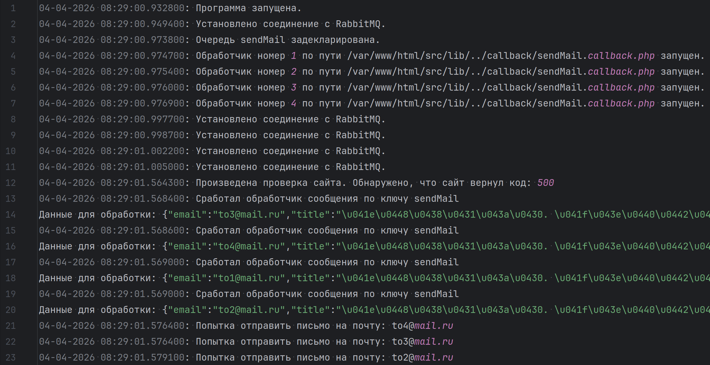

## Down Detector

Программа предназначенная для проверки доступности сайтов.

Имеет возможность:
- Отсылать письма на почту, если обнаружит, что сайт недоступен. 
- Мониторить несколько сайтов параллельно
- Отправлять письма на почту параллельно

Используется docker, поэтому для запуска достаточно создать .env файл
на подобии .env.example
и выполнить команду в консоли:

`docker compose down && docker compose up --build`

После этого программа запустится. Ничего более не требуется.

Можно отслеживать работу программы по логам. Логи будут складываться в папку logs.
Внутри logs каждая отдельная папка - логи за конкретный календарный день

Пример логов:

